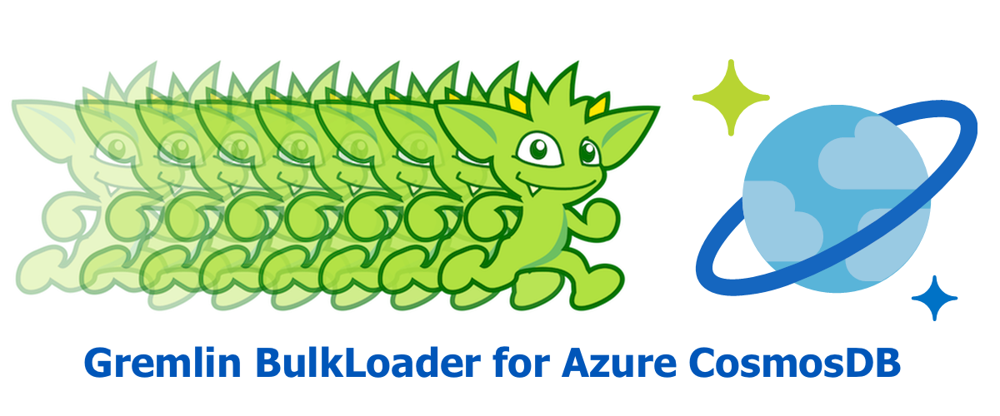

# azure-cosmosdb-gremlin-bulkloader

A BulkImport utility program to load an Azure CosmosDB Graph database from CSV files/blobs.

<p align="center"></p>

### Credits

This GitHub repository is based on the work by **Matias Quaranta** on the Microsoft 
Azure CosmosDB Team, see https://github.com/ealsur/GraphBulkExecutorV3.

## Inputs

This utility program can load **CSV data** into Azure CosmosDB Graph database using
CosmosDB **BulkLoad** SDK functionality.

The CSV files can be located either:
- On the local filesystem where this BulkLoader program executes
- In Azure Storage, as Blobs

**You will typically load several CSV files into your Graph, one-at-a-time.**

**Vertex files and Edge files have different required formats, as described below**.

**Since the input is in CSV format, each row within a file has to have the same "shape"**.

### Request Units (RU) and Recommended Use

The BulkLoad program will add data to your CosmosDB database at a high velocity,
therefore it will consume RUs quickly.  Therefore, the following is recommended:

- First use this utility program on a development or test database, not production
- Run the program several times, vs your development or test database, to get familiar with it
- Start with a smaller subset CSV files of your actual full-volume data
- Use the **--throttle** command-line argument; start with the default value of 5
- Set the database to **50,000+ RU, Autoscaled, at time of loading**
- Use verification queries, such as the following, to ensure all of your data gets loaded

#### Verification Queries for the Sample IMDb dataset

You can query your CosmosDB/Gremlin database in Azure Portal using SQL syntax, as shown here:

```
SELECT COUNT(1) FROM c where c.label = 'Movie'

SELECT COUNT(1) FROM c where c.label = 'Person'

SELECT COUNT(1) FROM c where c.label = 'has_person'

SELECT COUNT(1) FROM c where c.label = 'is_in'

SELECT COUNT(1) FROM c 
[
  {
    "$1": 758844    <-- this is the correct count
  }
]
```

### Configuration

The program is driven by both **environment variables** and **command-line arguments**.

The environment variables are used for **secrets**, while the command-line arguments
are for general parameters.

#### Environment Variables

Set the following three environment variables on your system.  The first three are 
required, the fourth is needed only when reading CSV files from Azure Storage.

```
AZURE_COSMOSDB_GRAPHDB_CONN_STRING
AZURE_COSMOSDB_GRAPHDB_DBNAME
AZURE_COSMOSDB_GRAPHDB_GRAPH
AZURE_STORAGE_CONNECTION_STRING
```

See your accounts in Azure Portal for the connection strings.

Use the above database and graph names for AZURE_COSMOSDB_GRAPHDB_DBNAME and
AZURE_COSMOSDB_GRAPHDB_GRAPH, respectively.

#### Command-Line and Scripts

The program is a **dotnet Console application** and uses command-line arguments.

The first command-line arg should be one of the following:

- **preprocess** - to scan and parse your input file before loading, for validation
- **load** - to load the target database, specified by the above environment variables

Several command-line arguments are available to define the format of your CSV files:

- **--csv-field-sep** - the separator character between CSV fields
- **--datatype-sep** - the separator used to define a datatype in a field of the header row
- **--array-sep** - used to separate string-array values

For using local CSV files, set this arg:

- **--csv-infile** - the csv input file

For using CSV files in Azure Storage, set these two args:

- **--blob-container** - the Azure Storage container
- **--blob-name** - the Blob name within the the Azure Storage container

Additionally, several other command line arguments are available:

- **--partition-key** - specify the partition key attribute name; defaults to **pk**.
- **--verbose** - verbose flag.  if true, then each row will be displayed; defaults to **false**.
- **--batch-size** - used during **load** runs of the program; defaults to **10,000**.  Enables processing huge input files.
- **--throttle** - used during **load** runs of the program; an integer from 1 (slower) to 10 (faster).  Defaults to 5.

See the following scripts in this repository with command-line examples:

```
cosmosdb-gremlin-bulkloader/loader/load_imdb_graph_from_blobs.ps1  (PowerShell for Windows)
cosmosdb-gremlin-bulkloader/loader/load_imdb_graph_from_blobs.sh   (bash for Linux & macOS)
cosmosdb-gremlin-bulkloader/loader/load_imdb_graph_from_files.ps1  (PowerShell for Windows)
cosmosdb-gremlin-bulkloader/loader/load_imdb_graph_from_files.sh   (bash for Linux & macOS)
```

### CSV File Format

**The program is prescriptive regarding the format and content of the CSV files.**

**Vertices and Edges should be separated into their own files, and only one file may be loaded by each execution of the program.**

Users of this utility are expected to create/wrangle input CSV files with correlated values
so as to create a well-formed graph in CosmosDB.  For example, the rows in the Edge
files are expected to refer to the correct ID and Partition Key values of the Vertices
in the graph which they are connecting to.

**The Vertices should be loaded first, then the Edges.**

See the [companion repository](https://github.com/cjoakim/azure-cosmosdb-gremlin-bulkloader-sample-data) 
which contains an example of creating a logical set of CSV files with python and pandas.

#### Vertices

Vertices files should contain three required fields, and may contain additional
fields for the vertex properties.

```
Vertex Files:
  Field  0:   Id, string
  Field  1:   Pk (Partition Key), string
  Field  2:   Label, string
  Fields 3-n: Properties
              Format 1: <vertex-property-name>
              Format 2: <vertex-property-name><datatype-separator><data-type>
                        <vertex-property-name> should have no embedded spaces
                        <separator> This should be the value of --datatype-sep
                        <data-type> is one of 'string','string[]','int','long', 'double' or 'bool';
                        defaults to 'string'
```

Sample Movie Vertex CSV:

Note how the Year and Minutes columns specify the **int** datatype (i.e. - 'Year:int');
the program will cast these from string to int objects at runtime.

```
Id,Pk,Label,Title,Year:int,Minutes:int
tt0015724,tt0015724,Movie,Dama de noche,1993,102
tt0035423,tt0035423,Movie,Kate & Leopold,2001,118
tt0036177,tt0036177,Movie,Muhomatsu no issho,2008,100
tt0036606,tt0036606,Movie,Another Time Another Place,1983,118
tt0057713,tt0057713,Movie,Threshold of Spring,1983,120
tt0087277,tt0087277,Movie,Footloose,1984,107
```

Sample Person Vertex CSV:

```
Id,Pk,Label,Name
nm0844752,nm0844752,Person,Rafael Sánchez Navarro
nm0869732,nm0869732,Person,Cecilia Toussaint
nm0194720,nm0194720,Person,Miguel Córcega
nm0650495,nm0650495,Person,Regina Orozco
nm0000212,nm0000212,Person,Meg Ryan
nm0413168,nm0413168,Person,Hugh Jackman
nm0000102,nm0000102,Person,Kevin Bacon
```

#### Edges

Vertices files should contain nine required fields, and may contain additional
fields for the edge properties.

```
Field  0:   EdgeId, string
Field  1:   EdgePk (Partition Key), string
Field  2:   EdgeLabel, string
Field  3:   FromVertexId, string
Field  4:   FromVertexPk, string
Field  5:   FromVertexLabel, string
Field  6:   ToVertexId, string
Field  7:   ToVertexPk, string
Field  8:   ToVertexLabel, string
Fields 9-n: Properties
```

Edge Properties are defined in a similar manner to Vertex Properties, described above.

Sample movie-to-person Edges CSV:

This models the "Movie has Person" relationship.

```
EdgeId,EdgePk,EdgeLabel,FromVertexId,FromVertexPk,FromVertexLabel,ToVertexId,ToVertexPk,ToVertexLabel,epoch:double
tt0015724-nm0844752,tt0015724-nm0844752,has_person,tt0015724,tt0015724,Movie,nm0844752,nm0844752,Person,1620420702.180296
tt0015724-nm0869732,tt0015724-nm0869732,has_person,tt0015724,tt0015724,Movie,nm0869732,nm0869732,Person,1620420702.1803021
tt0015724-nm0194720,tt0015724-nm0194720,has_person,tt0015724,tt0015724,Movie,nm0194720,nm0194720,Person,1620420702.180306
```

---

### Implementation 

This program is implemented in **C#** and **net5.0** as a **Console App**,
and thus is cross-platform across Windows, Linux, and macOS.  Furthermore,
the program can be executed as a Docker container.

The key [NuGet](https://www.nuget.org/) packages it uses are:
- [Microsoft.Azure.Cosmos](https://www.nuget.org/packages/Microsoft.Azure.Cosmos/3.18.0)
  - Uses a CosmosClient, with AllowBulkExecution = true
- [Azure.Storage.Blobs](https://www.nuget.org/packages/Azure.Storage.Blobs/12.8.3)
  - Read CSV files/blobs from Azure Storage
- [CsvHelper](https://www.nuget.org/packages/CsvHelper/)
  - CSV files are read in batches as a stream of System.Dynamic.ExpandoObjects

#### Compiling/Building the Code

```
$ cd cosmosdb-gremlin-bulkloader/loader
$ dotnet restore
$ dotnet build

Microsoft (R) Build Engine version 16.9.0+57a23d249 for .NET
Copyright (C) Microsoft Corporation. All rights reserved.

...

Build succeeded.
    0 Warning(s)
    0 Error(s)
```

Alternatively, see **build.sh** in this directory.

```
$ ./build.sh 
  - or -
$ ./build.sh container
```

### Sample Data - Six Degrees of Kevin Bacon

This sample data implements a [Six Degrees of Kevin Bacon](https://en.wikipedia.org/wiki/Six_Degrees_of_Kevin_Bacon)
graph.

See the instructions for using [the curated IMDb dataset](IMDb.md), as well as the
[companion repository](https://github.com/cjoakim/azure-cosmosdb-gremlin-bulkloader-sample-data).

### Sample Output

The program will log informative output so that you can verify the configuration
and success of the job, as shown below.

It will log, in sequence:
- The command-line arguments
- The computed configuration with all command-line parameters, and its validity
- Information about the parsed CSV header row and its fields
- The first three rows - both parsed CSV fields, then the Gremlin Element as JSON
- The loading of the individual **batches** of elements, default size is 25,000
- End-of-job totals like: "Main completed in: 76089 ms, rowCount: 276552"

**It is recommended that you first run the job in "preproces" mode before "load" mode.**

```
=== movie_vertices
start timestamp: 2021/05/16 12:36:13
Config#IsValid args: ["load","--notverbose","--throttle","5","--file-type","vertex","--batch-size","20000","--partition-key","pk","--csv-infile","/Users/cjoakim/github/azure-cosmosdb-gremlin-bulkloader-sample-data/imdb/loader_movie_vertices.csv"]
file input specified for this run
Config:
  args:            ["load","--notverbose","--throttle","5","--file-type","vertex","--batch-size","20000","--partition-key","pk","--csv-infile","/Users/cjoakim/github/azure-cosmosdb-gremlin-bulkloader-sample-data/imdb/loader_movie_vertices.csv"]
  run type:        load
  infile:          /Users/cjoakim/github/azure-cosmosdb-gremlin-bulkloader-sample-data/imdb/loader_movie_vertices.csv
  file type:       vertex
  batch size:      20000
  csv field sep:   ,
  datatype sep:    :
  array value sep: ^
Config#IsValid args: ["load","--notverbose","--throttle","5","--file-type","vertex","--batch-size","20000","--partition-key","pk","--csv-infile","/Users/cjoakim/github/azure-cosmosdb-gremlin-bulkloader-sample-data/imdb/loader_movie_vertices.csv"]
file input specified for this run
GraphBulkExecutor constructor:
  appName:  GraphBulkImporter-1.0.0.0-v4.0.30319
  dbName:   dev
  collName: imdb_files
  connStr:  AccountEndpoint=https://cjoakimcosmosgremlin.documents.azure.com:443/;AccountKey
GraphBulkExecutor#constructor completed
GraphBulkExecutor#InitializeThrottle...
GraphBulkExecutor#GetThroughputRU databaseRU 5000
GraphBulkExecutor#GetThroughputRU containerRU 
GraphBulkExecutor#InitializeThrottle targetRuSetting 5000
Throttle constructor; value: 5, actualRu: 5000, multiplier: 2, delay: 14500
Throttle; value: 5, ru: 5000, delay: 14500, multiplier: 2
CsvReader header row fields: [
  "Id",
  "Pk",
  "Label",
  "Title",
  "Year:int",
  "Minutes:int"
]
HeaderRow:
  source:       file: /Users/cjoakim/github/azure-cosmosdb-gremlin-bulkloader-sample-data/imdb/loader_movie_vertices.csv
  fileType:     vertex
  fieldSep:     ,
  datatypeSep:  :
  field count:  6
  errors count: 0
  CsvField index: 0, key: Id, name: Id, datatype: string, valid: True
  CsvField index: 1, key: Pk, name: Pk, datatype: string, valid: True
  CsvField index: 2, key: Label, name: Label, datatype: string, valid: True
  CsvField index: 3, key: Title, name: Title, datatype: string, valid: True
  CsvField index: 4, key: Year:int, name: Year, datatype: int, valid: True
  CsvField index: 5, key: Minutes:int, name: Minutes, datatype: int, valid: True
  row dict: {
  "Id": "tt0015724",
  "Pk": "tt0015724",
  "Label": "Movie",
  "Title": "Dama de noche",
  "Year:int": "1993",
  "Minutes:int": "102"
}
{
  "Id": "tt0015724",
  "Label": "Movie",
  "Properties": {
    "pk": [
      {
        "Id": null,
        "Key": "pk",
        "Value": "tt0015724"
      }
    ],
    "Title": [
      {
        "Id": null,
        "Key": "Title",
        "Value": "Dama de noche"
      }
    ],
    "Year": [
      {
        "Id": null,
        "Key": "Year",
        "Value": 1993
      }
    ],
    "Minutes": [
      {
        "Id": null,
        "Key": "Minutes",
        "Value": 102
      }
    ]
  }
}
  row dict: {
  "Id": "tt0035423",
  "Pk": "tt0035423",
  "Label": "Movie",
  "Title": "Kate & Leopold",
  "Year:int": "2001",
  "Minutes:int": "118"
}
{
  "Id": "tt0035423",
  "Label": "Movie",
  "Properties": {
    "pk": [
      {
        "Id": null,
        "Key": "pk",
        "Value": "tt0035423"
      }
    ],
    "Title": [
      {
        "Id": null,
        "Key": "Title",
        "Value": "Kate & Leopold"
      }
    ],
    "Year": [
      {
        "Id": null,
        "Key": "Year",
        "Value": 2001
      }
    ],
    "Minutes": [
      {
        "Id": null,
        "Key": "Minutes",
        "Value": 118
      }
    ]
  }
}
  row dict: {
  "Id": "tt0036177",
  "Pk": "tt0036177",
  "Label": "Movie",
  "Title": "Muhomatsu no issho",
  "Year:int": "2008",
  "Minutes:int": "100"
}
{
  "Id": "tt0036177",
  "Label": "Movie",
  "Properties": {
    "pk": [
      {
        "Id": null,
        "Key": "pk",
        "Value": "tt0036177"
      }
    ],
    "Title": [
      {
        "Id": null,
        "Key": "Title",
        "Value": "Muhomatsu no issho"
      }
    ],
    "Year": [
      {
        "Id": null,
        "Key": "Year",
        "Value": 2008
      }
    ],
    "Minutes": [
      {
        "Id": null,
        "Key": "Minutes",
        "Value": 100
      }
    ]
  }
}
Start of batch load 1, with 20000 elements, at 2021/05/16 12:36:16
Batch load 1 completed in 17601ms
Start of batch load 2, with 20000 elements, at 2021/05/16 12:36:33
Batch load 2 completed in 18060ms
Start of batch load 3, with 20000 elements, at 2021/05/16 12:36:52
Batch load 3 completed in 17857ms
Start of batch load 4, with 12253 elements, at 2021/05/16 12:37:10
Batch load 4 completed in 16237ms
finish timestamp: 2021/05/16 12:37:26
Main completed in: 72617 ms, rowCount: 72254
Disposing GraphBulkExecutor...
GraphBulkExecutor#Dispose completed
```

---

### Docker Support

This BulkImport utility program can be packaged and executed as a Docker Container.
See files **Dockerfile**, **.dockerignore**, and **build.sh** in subdirectory
**cosmosdb-gremlin-bulkloader/loader**.

The following public image is available on DockerHub:
```
cjoakim/cosmosdb-gremlin-bulkloader:latest
```

Since this BulkImport utility can be containerized, it can run in environments such as 
**Docker Compose**, **Azure Container Instances (ACI)**, or **Azure Kubernetes Service (AKS)**.

#### Docker Compose

The following is the **docker-compose.yml** file.  Note how you can pass in both environment
variables and command line arguments to the program.

```
version: '3'
services:
  console:
    image: cjoakim/cosmosdb-gremlin-bulkloader
    environment:
    - AZURE_COSMOSDB_GRAPHDB_CONN_STRING=${AZURE_COSMOSDB_GRAPHDB_CONN_STRING}
    - AZURE_COSMOSDB_GRAPHDB_DBNAME=${AZURE_COSMOSDB_GRAPHDB_DBNAME}
    - AZURE_COSMOSDB_GRAPHDB_GRAPH=${AZURE_COSMOSDB_GRAPHDB_GRAPH}
    - AZURE_STORAGE_CONNECTION_STRING=${AZURE_STORAGE_CONNECTION_STRING}
    - CLI_ARGS_STRING=preprocess --!verbose --file-type vertex --blob-container bulkloader --blob-name imdb/loader_movie_vertices.csv
```

You can execute the BulkLoader with Docker Compose as follows:

```
$ docker-compose up        <-- start and execute the container
$ docker-compose ps        <-- check the status of the container
$ docker-compose down      <-- shut down the container
```

#### Azure Container Instances (ACI)

See the **cosmosdb-gremlin-bulkloader/loader/aci/** directory in this repository.

There are working bash scripts there that can execute this Docker container
in ACI, as well as fetch the logs produced by the program.

Example Use:

```
$ ./create-instance.sh provision    <-- create and execute the ACI
$ ./show-instance.sh
$ ./get-log.sh                      <-- download the logs
$ ./delete-rg.sh                    <-- delete the resource group when job is complete
```
